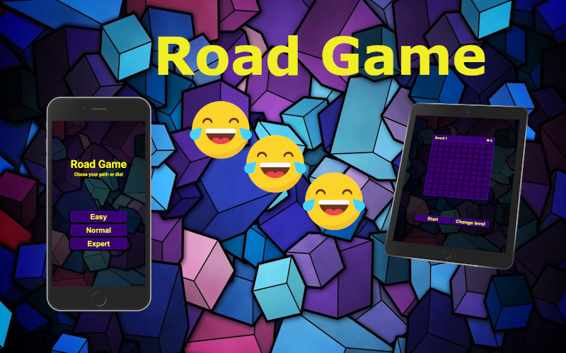

# Road Game: chose your path or die! :laughing: :laughing: :laughing:
***

***

# About the project :rocket:
The Simple game developed based on React where AI creates the road for us and we have to remember parts of its and then remind by choosing parts of the road in order. The Game has three difficulty levels and each one has ten maps for completed.

***
Link to the project ---> [Click](https://maciekspalek.github.io/RoadGame/)
***
# Project created with :mortar_board:
1. :fire: Semantic HTML5.

2. :boom: Block Element Modifier.

3. :fire: SASS.

3. :boom: Grid and Flex Box.

4. :fire: RWD.

5. :boom: React.

***
# Library
1. :fire: ClassNames
***
# Tools:
1. :muscle: Visual Studio Code.

2. :muscle: Gimp.

3. :muscle: Git.

***
# Creators

1. Maciek Spałek -  [Click](https://github.com/MaciejSpalek)

2. Piotr Grobelak -  [Click](https://github.com/PiotrGrobelak)

***
# Configuration for localhost:

:star: `npm install -g gulp-cli`

:star: `npm install`

:star: `npm start`

To publish your page using github pages use `npm run deploy` :star2: